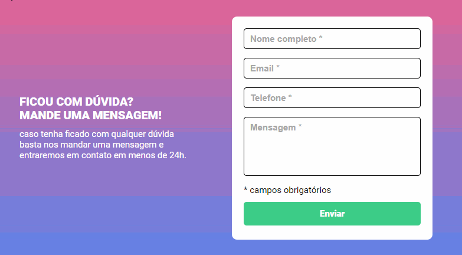

# Pokedex Poke-API



## Propósito

O projeto visa criar uma experiência interativa e amigável por meio de um formulário simples. O principal propósito é oferecer uma solução que valide e forneça feedback instantâneo ao usuário quando este preenche os campos do formulário. Além disso, o projeto tem como objetivo prático demonstrar o desenvolvimento de habilidades em manipulação de formulários usando tecnologias web, como HTML, CSS e JavaScript. A ênfase na validação dos campos busca aprimorar a usabilidade e fornecer uma experiência mais fluida para o usuário final.

## Funcionalidades

1. **Validação de Campos:**
   - Verificação instantânea se os campos obrigatórios foram preenchidos corretamente.

2. **Feedback ao Usuário:**
   - Exibição de mensagens claras e amigáveis informando sobre o preenchimento adequado dos campos.

3. **Botão de Envio:**
   - Funcionamento do botão de envio apenas quando todos os campos obrigatórios estão preenchidos corretamente.
   
4. **Experiência Intuitiva:**
   - Foco na criação de uma experiência de usuário intuitiva e fácil de usar.

5. **Responsividade:**
   - Adaptação do layout para diferentes tamanhos de tela, garantindo uma experiência consistente em dispositivos variados.
   
6. **Aprimoramento Contínuo:**
   - Oportunidade para futuras melhorias e adição de funcionalidades conforme necessário.
   
## Ferramentas utilizadas


1. **HTML:**
   -  Estruturação do conteúdo.

2. **CSS:**
   - Estilização e apresentação visual.

3. **JavaScript:**
   - Lógica de validação e interatividade.

## Decisões de Projeto


2. **Separação de Responsabilidades em Arquivos:**
   - Mantive a separação de arquivos CSS para a melhor organização dos estilos e facilitar o desenvolvimento do projeto. Os arquivos CSS estão estruturados de acordo com a função e escopo, seguindo um padrão de nomenclatura claro.

## Como utilizar

1. Clone o repositório:

    ```bash
    git clone https://github.com/Paulo-Heber/Formulario.git
    ```

2. Abra a pasta do projeto e dê dois cliques sobre o arquivo index.html.


